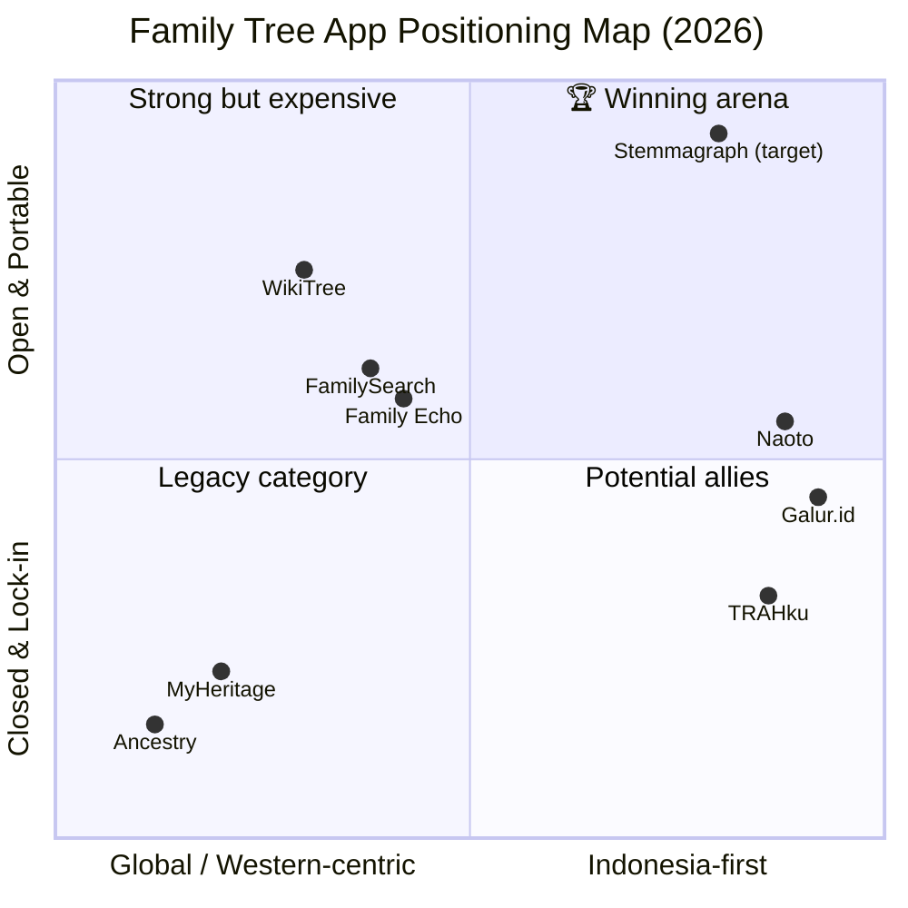
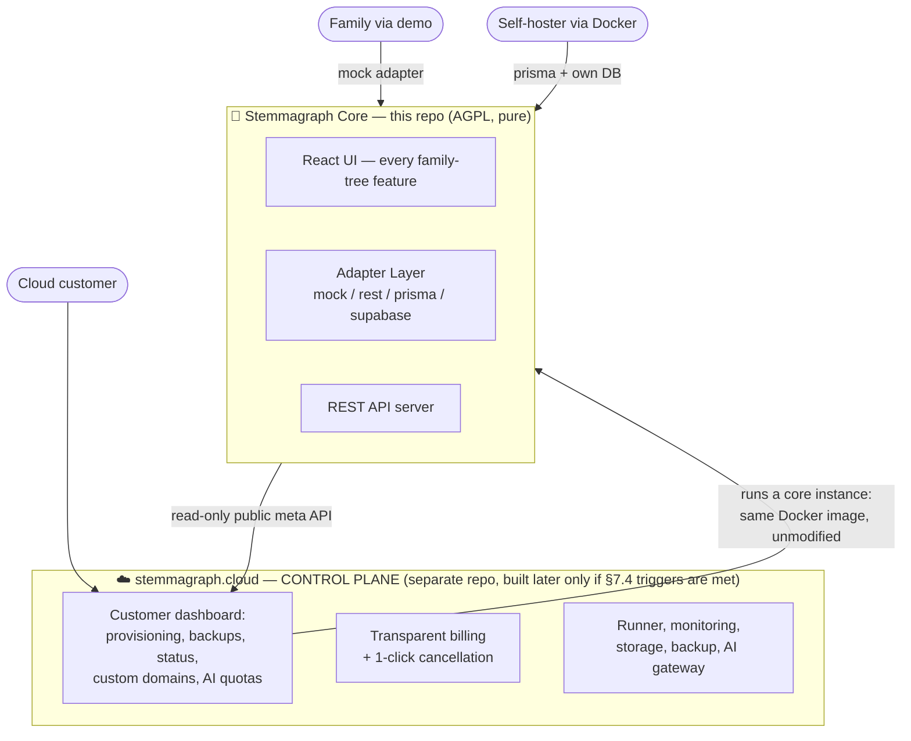
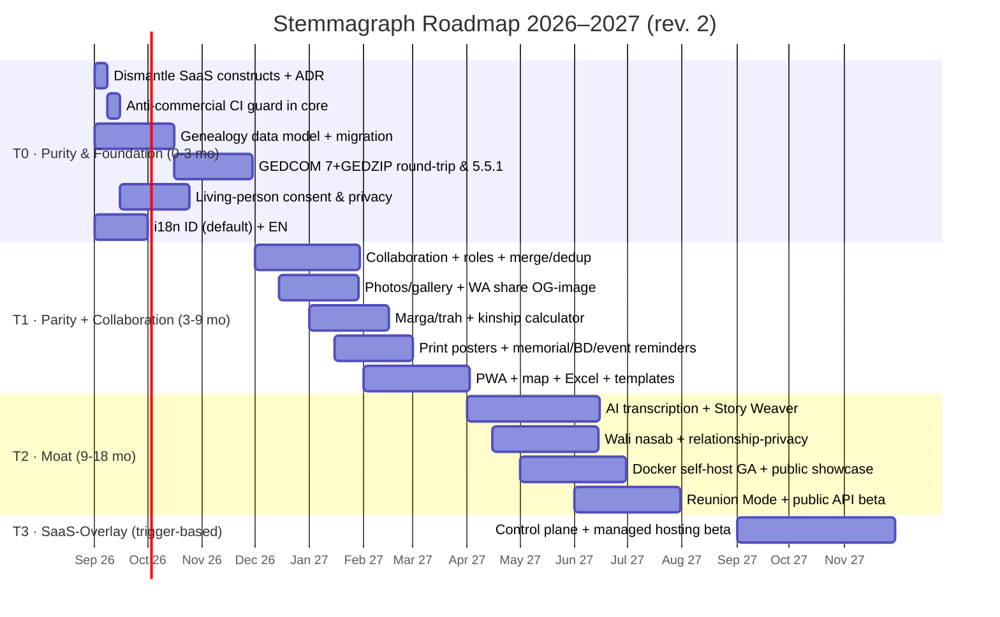

# 🌳 Stemmagraph Product Vision

> **Status**: 🟢 Active
> **Topic**: Product vision, market-fit strategy, pure-core architecture, differentiation & feature roadmap
> **Updated**: 2026-08-16 (rev. 3 — full English rewrite for the international open-source audience; rev. 2 — synthesis of global market + pain-point research, Pure Core → SaaS-Overlay strategy)
> **Tags**: vision, strategy, market-fit, competitor-analysis, roadmap, architecture
> **Research basis**: `docs/research/01-global-market-research.md`, `docs/research/02-pain-points-and-feature-needs.md`
> **Supersedes**: — (first vision document)

---

## Table of Contents

1. [Product Vision](#1-product-vision)
2. [Audit: Where We Stand Today](#2-audit-where-we-stand-today)
3. [Market Landscape & Competitor Analysis](#3-market-landscape--competitor-analysis)
4. [Positioning & Differentiation Strategy](#4-positioning--differentiation-strategy)
5. [Strategic Architecture: Pure Core → SaaS-Overlay](#5-strategic-architecture-pure-core--saas-overlay)
6. [Must-Have Features for Market Fit](#6-must-have-features-for-market-fit)
7. [Business Model: Pure Today, SaaS-Overlay Later](#7-business-model-pure-today-saas-overlay-later)
8. [Execution Roadmap](#8-execution-roadmap)
9. [Success Metrics](#9-success-metrics)
10. [Risks & Mitigations](#10-risks--mitigations)
11. [Product Principles (11 Tenets)](#11-product-principles-11-tenets)

---

## 1. Product Vision

### 1.1 Vision Statement

> **To become the digital home of family legacy — the place where every extended family, starting with Indonesia and Southeast Asia, builds, maintains, and passes down its genealogy collaboratively, privately, and permanently; and globally, to become the modern open-source standard for genealogy: beautiful, interoperable, and free of lock-in.**
>
> **Stemmagraph is a pure product, not a freemium one: every family-tree feature runs in full for anyone who runs it. If a paid service ever exists, it stands on top of the app — never inside it.**

### 1.2 One-Liner (for the landing page / pitch)

> **"A living family tree, a legacy that lasts."**

Variants:
- "Build your extended family's tree together — not alone."
- "The family tree app that will never hold your family's data hostage."

### 1.3 Positioning Statement (formal)

> For **extended families in Indonesia & the diaspora** who want to document multi-generational genealogy, **Stemmagraph** is an **open-source** genealogy platform that combines a **modern interactive canvas**, **real-time family collaboration**, and **full interoperability (GEDCOM)**. Unlike **MyHeritage/Ancestry** — expensive, USD-priced, Western-centric, and data lock-in — and unlike **closed-source local apps** (TRAHku, Galur, Naoto) whose code is closed and whose data's future depends on the lifespan of a startup — Stemmagraph guarantees **permanence**: open code, exportable data at any time, and self-hostable forever.

### 1.4 Core Thesis (why this vision can win)

Genealogy is the only software category where **data outlives the company**. Families record their trees for the next 50–100 years; the average startup lives 5 years. The greatest fear of a serious genealogy user is not price — it is **losing decades of research because the app dies** (see OneGreatFamily's obsolete UI, or Geni's decline after acquisition).

Stemmagraph answers that fear structurally through **open source (AGPL) + native GEDCOM + self-hosting** — three things **no local competitor has**, and global players only partially offer. 2026 research hardens the thesis with hard evidence: **23andMe went bankrupt (Chapter 11, March 2025)** and its 13–15 million customers' genetic database was auctioned to TTAM Research Institute (US$305M) amid lawsuits from 27–28 US states; **Geni.com stagnated** after its MyHeritage acquisition (2012); and anti-subscription sentiment peaked — MyHeritage rates **1.9/5 on PissedConsumer** (333 reviews; 79% unfavorable; 63% say they won't use it again), dominated by complaints of unauthorized charges and cancellation friction. The market is looking for exactly what we are building: a product that is honest about data. That is the story that makes families switch and stay.

### 1.5 Product Purity Principle — the core architectural decision

Rev. 2 strategic decision: **the app is built pure, with no SaaS model inside it.**

1. **The core = the complete product.** Anyone — a family, a community, an institution — runs every family-tree feature with no limits, no premium flags, no quotas, no billing. "Anyone can use it" is a feature, not a phase.
2. **Future SaaS = a layer on top, not a patch inside.** If Stemmagraph ever becomes a paid service, we build a *dashboard/control plane* **on top of the existing app** — not a rebuild, and not billing embedded into it. Proven precedent: **WordPress.org (self-host) vs WordPress.com (SaaS)** and **Gramps (open source) vs grampshub.com (managed hosting)**.
3. **Practical consequence today:** every remaining mock-SaaS construct in the codebase (premium flag, 15-member paywall, upgrade page) **gets dismantled** (detail in §2.3), and the contribution contract bans commercial code from the core (detail in §5).
4. **Why this wins (not just idealism):** the global #1 pain point is precisely the *subscription trap* — a genuinely pure core is **an auditable proof of promise**, not a marketing claim. Trust = moat.

---

## 2. Audit: Where We Stand Today

Evidence-based from the codebase (not assumptions):

### 2.1 Assets We Already Have ✅

| Asset | Evidence | Strategic Value |
|---|---|---|
| Modern interactive canvas (React Flow v12 + dagre auto-layout) | `src/components/FamilyTree/ReactFlowTreeView.tsx`, `tierLayoutManager.ts`, deps `@xyflow/react@12`, `dagre` | Best-in-class UX among local players; MyHeritage/Ancestry UIs are heavy & dated; Family Echo/WikiTree look 2010s |
| 4 view modes (canvas / grid / table / list) | `FamilyTreeView.tsx`, `CardView.tsx`, `FamilyTable.tsx`, `ListView.tsx` | Browsing parity above the local average |
| Rich member profiles (birth/death dates, places, profession, education, photos, contacts, notes) | `prisma/schema.prisma` → `FamilyMember` | A genealogical data foundation ready to extend |
| 3 relationship types: parent-child, marriage, sibling (+ custom edges) | `FamilyRelationship`, `edges/MarriageEdge.tsx`, `ParentChildEdge.tsx`, `SiblingEdge.tsx` | Needs extension (see gaps) |
| PDF & PNG export | `controls/ExportControls.tsx`, deps `jspdf`, `html2canvas` | Basic parity; no HD posters/GEDCOM yet |
| JWT auth + bcrypt | `server/index.ts`, deps `jsonwebtoken`, `bcryptjs` | Production-ready with hardening |
| Full REST API (trees/members/relationships CRUD) | `server/index.ts` (17 endpoints) | Functional backend |
| Adapter architecture (mock / rest / supabase / prisma) | `src/lib/adapters/` | **The local-first + offline direction is built on this** — the most strategic architectural asset |
| No-signup demo on GitHub Pages | Live demo, mock adapter + seeded Wijaya family | **A zero-friction onboarding funnel — no competitor has this** |
| Dual licensing AGPL-3.0 + Commercial | `LICENSE`, `COMMERCIAL_LICENSE.md` | Legal moat for institutional needs — a licensing agreement, never touching the core |
| Open-source readiness (CI, CONTRIBUTING, SECURITY, branding) | `.github/`, README | Credibility & discoverability via GitHub |
| Validated market & pain-point research corpus (global + Indonesia) | `docs/research/01-…md`, `02-…md` | Evidence-based product decisions, not assumptions |

### 2.2 Critical Gaps (why we're not yet a "serious player") ❌

1. **No GEDCOM** — the international genealogy standard. TRAHku's is still "coming soon" on its top tier; Naoto & Galur already export. Without GEDCOM we're isolated from the ecosystem and can't onboard MyHeritage/Gramps users looking to switch.
2. **No multi-user collaboration** — the #1 feature extended families seek (TRAHku, Galur, and Naoto all sell it). The schema has no role/invitation concept yet.
3. **No photo upload & storage** — yet "archiving old photos" is the category's strongest emotional hook.
4. **No sharing links** (public/protected) — the WhatsApp distribution loop doesn't exist yet.
5. **No i18n** — the UI mixes languages (random EN/ID in the legacy upgrade page). Local competitors are fully Bahasa Indonesia.
6. **No family distribution map** — TRAHku's flagship feature.
7. **The data model isn't genealogy-grade yet**: `birthDate`/`deathDate` as member strings (not events), gender only male/female (GEDCOM needs "unknown"), no explicit multi-spouse, no relationship status (divorce), no step/adopted children, no place entity, no sources/citations.
8. **No mobile app / PWA** — local competitors have Android/iOS or at least a solid PWA.
9. **No real monetization — and none may exist in the core** — the remaining mock premium/payment pages are classified as **strategic debt** (see §2.3).
10. **The 15-member free tier is too stingy** — TRAHku gives 100 free members; an early paywall kills the extended-family viral loop.
11. **No consent management or living-person privacy** — legal research confirms this is **mandatory** (Indonesia's PDP Law No. 27/2022: children's & genetic data are "specific data"; administrative fines up to 2% of annual revenue, Art. 57(3); aligned with GDPR for the global market). Living-vs-deceased privacy doesn't exist at all yet.
12. **No merge/dedup engine** — the biggest lesson from WikiTree (a dedicated "Arborists" merge project) & FamilySearch (1.74 billion names; duplicates are a structural problem). Collaboration without a merge engine = duplicate chaos.

### 2.3 Strategic Debt: SaaS Constructs Inside the Core (must be dismantled) ⚠️

The §1.5 decision (pure product) means the following code **directly contradicts** the product direction and gets removed in Phase 0:

| Codebase evidence | Issue |
|---|---|
| `src/store/dashboardStore.ts` — `isPremium: boolean` + `setPremium()` (lines 9, 18, 26, 70; persisted!) | A commercial flag living in the core's global state |
| `src/components/Dashboard/Dashboard.tsx:14` — `maxMembersPerTree = isPremium ? Infinity : 15` | **Member paywall** — exactly the competitor design mistake we criticize (§3.4 #2) |
| `src/App.tsx` — route `/upgrade` + view `upgrade` (lines 4, 22, 52–53, 79) | A commercial route in a pure app |
| `src/components/Upgrade/UpgradePage.tsx` + `PaymentModal.tsx` | Full mock premium page (countdown, testimonials, Midtrans) — all fake |

Plan: remove all four in Phase 0 (±1 sprint), archive the decision as ADR `docs/decisions/0001-pure-core.md`, and install a **CI guard** that fails the build if commercial patterns appear in `src/` (detail in §5.3).

---

## 3. Market Landscape & Competitor Analysis

Synthesis of `docs/research/01-global-market-research.md` (global market, case evidence, open-source benchmarks) + `docs/research/02-pain-points-and-feature-needs.md` (validated pain points, Indonesian context, PDP Law, Islamic Code/Compilation) + direct verification of local competitor sites.

**Market size (indicative):** research-firm consensus places the global genealogy market at **~USD 5–7 billion (2025)** growing at **~11–12% CAGR** (Fact.MR: USD 6.7B 2025 → 21.7B 2036; Kings Research: 12.06%). North America ~45% share; **Asia-Pacific is the fastest-growing region (~13% CAGR)** — a tailwind for an Indonesia-first positioning. Demographics: users skew older (median age 63 in an Australian survey) → elder-friendly UX is a real advantage. *(Figures vary between firms; treat as indicative.)*

**Four validated global pain points — and all four are our answers:**
1. **Subscription traps** — MyHeritage 1.9/5 (PissedConsumer; 79% unfavorable; 63% won't use again); dominant complaints: unauthorized charges, hard-to-cancel, bot-only support.
2. **Lock-in & leaky GEDCOM** — GEDCOM 5.5.1 doesn't carry media/photos; Ancestry blocks third-party media downloads; FamilySearch has no native export (max 8 generations via GEDCOM 7); one user had to retype 251 entries during migration.
3. **Platform-death risk** — 23andMe Chapter 11 (2025), 13–15M customers' data auctioned; Geni stagnant post-acquisition.
4. **Learning curve & dated UX in open source** — Gramps criticized as "not user friendly" (GEPS 034), Webtrees requires PHP/hosting skills, Gramps Web has convoluted basic flows + 10k-person imports taking hours.

### 3.1 Global Players

| Product | Model & Pricing | Strengths | Weaknesses (our openings) |
|---|---|---|---|
| **MyHeritage** | Basic tree free; premium **$129–299/yr**; 90M users, 2.9B profiles | Records from 45+ countries, Smart Matching™, DNA, Deep Nostalgia™ | USD-expensive for the ID market, Western-centric UI, data lock-in, no self-host |
| **Ancestry** | From **$24.99/mo** ($189–389/yr); 6M+ subscribers | World's largest records database, ThruLines, DNA ecosystem | Most expensive, most locked-in, minimal Southeast Asia support |
| **FamilySearch** | **Completely free** (nonprofit) | World's largest shared tree, 2B+ records | One world tree — anyone can edit your ancestors; unsuitable for private clan/lineage trees |
| **WikiTree** | Free | Strong collaborative community, GEDCOM | Dated UI, one profile per person (not your own family tree) |
| **Family Echo** | Free | Simple, GEDCOM support & Indonesian language | 2010s UI, no mobile app, no extended-family collaboration |
| **OneGreatFamily** | $79.95/yr | World-tree concept | Severely dated UI — a case study in being left behind |
| **Canva / Visual Paradigm** | Freemium | Pretty family-tree chart templates | Not a genealogy database — no living relationships, no meaningful collaboration |
| **Gramps / Gramps Web** | Free (GPL/AGPL); paid managed hosting via grampshub.com | Deepest genealogy features (patronymics, multi-surname), privacy-first, GEDCOM-native | **Technical UX & weak mobile** — precisely our gap; its hosting-bridge business model = our monetization template |
| **Webtrees** | Free (GPL-3.0), self-hosted PHP/MySQL | The most mature open-source web tool; 60+ languages; granular privacy; 200+ contributors | Requires technical skills; complex UI; no mobile app — limited to technical hobbyists |

### 3.2 Local Indonesian Players (direct competitors)

| Product | Model & Pricing | Strengths | Weaknesses (our openings) |
|---|---|---|---|
| **TRAHku** (trahku.id) | Free ≤100 members; Silver **Rp100k/yr** (500 members, 1GB); Gold Rp250k/yr (+messaging, events, vault, family finance); Platinum Rp499k/yr (1000 members, GEDCOM *coming soon*) | The most feature-complete family suite: distribution map, photo/video/story archive, admin/editor/viewer roles, Android+iOS, custom subdomain (`name.trahku.id`), aggressive SEO blog (Batak marga, trah vs silsilah) | Closed source, GEDCOM not shipped yet, pay-per-member-count (a paywall mid-reunion), support email still gmail.com |
| **Galur.id** | Free-ish | **Multi-partner** (more than 1 spouse), password-protected WA share links, GEDCOM export, family feed, Islamic positioning (silaturahmi/kinship), public showcase trees (28 generations!) | Web-only, functional-not-beautiful design, no clear monetization → sustainability risk |
| **Naoto** (naoto.id) | 3 tiers (Free / Keluarga Plus / Keluarga Max) | Technically the most advanced: automatic layout from relationship data, Indonesian kinship terms (seayah/seibu — same father/mother, besan — in-laws, ipar — sibling-in-law, step/adopted children), Excel import, GEDCOM/PNG/SVG export, AES-256-GCM per-family encryption, review controls, even an `llms.txt` (AI-ready) | Closed source, small brand, no self-host |
| **Pohon Keluarga** (pohonkeluarga.com) | — | Invite relatives to expand the tree | Minimal digital footprint — signs of a stagnant product |

### 3.3 Feature Matrix (parity check)

✅ = strong · 🟡 = partial / coming soon · ❌ = none

| Capability | Stemmagraph **today** | Stemmagraph **target** | MyHeritage | TRAHku | Galur | Naoto |
|---|---|---|---|---|---|---|
| Modern interactive canvas | ✅ | ✅ | 🟡 | 🟡 | 🟡 | ✅ |
| Grid / table / list views | ✅ | ✅ | 🟡 | ❌ | ❌ | ❌ |
| GEDCOM import+export | ❌ | ✅ **always free** | ✅ | 🟡 | 🟡 | ✅ |
| Collaboration + roles | ❌ | ✅ | ✅ | ✅ | 🟡 | ✅ |
| Multi-partner / historical polygamy | ❌ | ✅ | ✅ | ❌ | ✅ | ✅ |
| Step / adopted children | ❌ | ✅ | ✅ | ❌ | ❌ | ✅ |
| Indonesian kinship terms | ❌ | ✅ | ❌ | 🟡 | 🟡 | ✅ |
| Marga/trah/clan-name/title schema | ❌ | ✅ | ❌ | ✅ | 🟡 | 🟡 |
| Photo upload + archive | ❌ | ✅ | ✅ | ✅ | ❌ | ✅ |
| Family distribution map | ❌ | ✅ | 🟡 | ✅ | ❌ | ❌ |
| Protected share links | ❌ | ✅ | 🟡 | 🟡 | ✅ | 🟡 |
| Print-quality reunion posters | ❌ | ✅ | 🟡 | ✅ | ❌ | 🟡 |
| Excel import | ❌ | ✅ | ❌ | ❌ | ❌ | ✅ |
| No-signup demo | ✅ | ✅ | ❌ | ❌ | ❌ | ❌ |
| **Open source** | ✅ | ✅ | ❌ | ❌ | ❌ | ❌ |
| **Self-host** | ✅ (local) | ✅ (1-command Docker) | ❌ | ❌ | ❌ | ❌ |
| Per-family encryption | ❌ | ✅ | 🟡 | 🟡 | ❌ | ✅ |
| AI (handwriting transcription, narration) | ❌ | ✅ | 🟡 (Scribe AI, Deep Nostalgia) | ❌ | ❌ | ❌ |
| Native mobile app | ❌ | 🟡 (PWA first) | ✅ | ✅ | ❌ | ❌ |
| GEDCOM 7 + GEDZIP (media-inclusive) | ❌ | ✅ | ❌ (still 5.5.1) | ❌ | ❌ | ❌ |
| Living-person consent & privacy (PDP/GDPR-grade) | ❌ | ✅ | 🟡 | ❌ | ❌ | ❌ |
| Merge/dedup engine + approvals | ❌ | ✅ | ✅ | ❌ | ❌ | 🟡 (review controls) |

### 3.4 Key Research Insights

1. **The local arena is crowded but fragile.** Four local players, all closed-source, all small teams. Genealogy is a *decades-long* product — serious users ask "if the app dies, what happens to my data?" Nobody answers that. **That's our way in.**
2. **Pay-per-member-count is a design mistake.** A family tree's value grows with member count — and every member is a potential new invitee (viral loop). Paywalling at 100 members cuts the loop exactly as it starts spinning. TRAHku forces the *family* (not the individual) to pay mid-momentum. We invert it: **members & trees are never limited; what's paid for is added value** (storage, AI, HD posters, custom domain).
3. **GEDCOM is the ticket into the serious circle.** The genealogy community judges apps by their GEDCOM. Naoto understands this; TRAHku is late. We must surpass both: GEDCOM 5.5.1 **and** 7, import+export, **free on every tier** — make the *portability pledge* an ethical differentiator against MyHeritage/Ancestry.
4. **Cultural context = local table stakes.** Batak marga (clan names), Minang fam, Javanese trah, titles, multi-partner, step/adopted children, kinship terms (besan, ipar, cousins by full/half blood). Naoto is far ahead here — we must catch up *and* overtake (e.g., a "what is my relationship to X?" calculator).
5. **WhatsApp is the primary distribution channel.** Galur and TRAHku grow via WA share links. Design our entire sharing loop WA-first: links, beautiful WA link previews, and "try without signing up."
6. **Content SEO is the local acquisition engine.** TRAHku's blog (Batak marga, how to build a tree, trah vs silsilah) targets high-volume keywords. We need an equal content engine + a unique edge: **public showcase trees** (Galur's technique: royal families, historical figures → backlinks & organic virality).
7. **The no-signup demo is our unique weapon.** No competitor lets anyone try without registering. Scale it up: template gallery + start from a public tree.
8. **Portability must be proven, not promised.** The industry wound: GEDCOM 5.5.1 loses photos in migration. Our standard: **GEDCOM 7 + GEDZIP (media-inclusive) + a 100% lossless round-trip** as a measurable claim.
9. **Privacy = legal compliance, not an optional feature.** Indonesia's PDP Law (fines ≤2% of annual revenue; children's & genetic data = "specific data") + GDPR (erasure ≤30 days, living persons). Bonus: *relationship-based privacy* isn't owned even by Gramps Web — a chance to lead the category.
10. **2026 AI = handwriting transcription & narration — but the industry fears hallucination.** FamilySearch Full-Text Search (1.2 billion images as of March 2025), Ancestry AI Stories (940M records, 6 languages), MyHeritage Scribe AI. Our position: **source-grounded** — every output links its source & flags uncertainty. "Anti-hallucination" as a brand stance.
11. **DNA: still AVOID for the core (validated by research).** Weak Southeast Asian reference panels + genetics = "specific data" under the PDP Law (highest legal risk). If ever relevant: optional raw-upload à la GEDmatch — Tier 3, far in the future.
12. **The winning open-source monetization model = the managed-hosting bridge.** Gramps Web → grampshub.com proves a commercial bridge without betraying the community. Exactly our SaaS-Overlay pattern (§5).

### 3.5 Open-Source Ecosystem Benchmark (our ideological competitors)

| Project | License & Model | Lesson for us |
|---|---|---|
| **Gramps** (2001–) | GPL, Python desktop, volunteer community | Deepest genealogy features (patronymics, multi-surname) — but UX/mobile failed to reach regular users |
| **Gramps Web** | AGPL-3.0, web + 2-way sync + AI assistant | Same architecture & license as us; small community; no relationship-privacy — our gap |
| **Webtrees** | GPL-3.0, PHP self-host, 200+ contributors | Proof that an open-source genealogy community lives; mature granular privacy; aging UI |
| **grampshub.com** | Paid managed hosting on top of Gramps Web | **The SaaS-Overlay business template** — free core, paid convenience |
| **WikiTree** | Free, single world tree, MIT read-only API | The world-tree model = edit conflicts; its open API = Tier 3 inspiration |

**The winning formula (research):** projects that endure have (a) strong GEDCOM interop, (b) contributor & translation communities, (c) privacy as a core value. Those that fail traction: bad UX, no mobile, hard onboarding. We combine both: the open-source values of Gramps/Webtrees + the modern UX they lack.

---

## 4. Positioning & Differentiation Strategy

### 4.1 Positioning Map

**The top-right quadrant (Indonesia-first × Open/Portable) is empty. We claim it now.**

### 4.2 Six Pillars of Differentiation

#### Pillar 1 — Permanence ("Your family's data will never be held hostage") 🏰
- Open source AGPL — anyone can audit & continue it
- **Portability Pledge**: GEDCOM 7 + GEDZIP (media-inclusive) + JSON + Excel export **free, in every mode, forever** — with the measurable claim of a *100% lossless round-trip*
- Self-host with a single Docker command (technical families, foundations, customary institutions)
- Narrative ammunition (industry evidence): 23andMe's bankruptcy & data auction (2025); Geni's stagnation; MyHeritage at 1.9/5 (PissedConsumer)
- *Pitch:* "Apps can die. Your family tree shouldn't."

#### Pillar 2 — Collaboration that makes an extended family feel alive 👨‍👩‍👧‍👦
- Not just shared CRUD: a family activity feed, comments on profiles ("Isn't this the uncle who told stories at the 2015 reunion?"), WA invites with beautiful previews
- Roles: Owner / Editor / Viewer + **review mode** (changes to elders' data require approval — respecting Indonesian family hierarchy)
- Live stats: generation count, member spread, upcoming birthdays → a reason to return regularly

#### Pillar 3 — Deep Nusantara localization 🇮🇩
- Name schemas: marga (Batak), fam (Minang), trah (Javanese lineage), tarombo, titles/gelar, aliases/pen names
- Relationships: multi-partner (including historical polygamy), stepchildren, adopted children, in-laws (besan), full/half-blood cousins
- **Kinship calculator**: "What's my relationship to Mr. X?" with the lineage path visualized — a *signature* feature no competitor has visually
- Full Bahasa Indonesia UI (default) + English, i18n from day one

#### Pillar 4 — World-class beauty & speed 🎨
- A smooth React Flow canvas (already ours) + tiered dagre auto-layout
- Print-quality reunion posters (A1–A0, vector PDF) with cultural themes (batik, songket) — instantly a keepsake
- Fast, offline-capable PWA — built on the existing adapter architecture

#### Pillar 5 — Source-grounded AI, not gimmicks 🤖
- **AI Handwriting Transcription** (the 2026 industry standard — FamilySearch FTS at 1.2 billion images; MyHeritage Scribe AI): photos of handwritten lineage books/tarombo/babad manuscripts, family cards (KK), certificates → structured data for review. Plain OCR is inadequate for Indonesian manuscripts — this is **transcription**, not just OCR
- **Story Weaver**: drafts member biographies from data + attached sources → families just edit; every claim links its source
- **Photo Restore** (optional): old-photo repair before poster printing
- Brand stance: **anti-hallucination** — every output links its original source & flags uncertainty (in contrast to the concern Ancestry's own CTO admits). All AI opt-in + BYO API key on self-host; family data is never used for training without explicit consent

#### Pillar 6 — Privacy & compliance as a first-class feature 🔐
- **Per-living-person consent management**: consent records (who, when, scope), consent withdrawal flows, *right-to-be-forgotten* ≤30 days — meeting **Indonesia's PDP Law No. 27/2022** (fully enforceable since 17 Oct 2024; fines ≤2% of annual revenue) **and GDPR** with one architecture
- **Living vs deceased by design**: living members' data is private by default & visible by relationship — answering FamilySearch's structural complaint (can't share living-person data among members) and surpassing Gramps Web (they lack *relationship-based privacy*)
- Encryption at rest + per-family key isolation (parity with Naoto, AES-256-GCM)
- Private by default; public always intentional

### 4.3 Anti-Positioning (what we will NOT chase)

| Temptation | Decision | Rationale |
|---|---|---|
| Historical records databases (census, archives) | ❌ No | Enormous capital; MyHeritage/Ancestry/FamilySearch's arena; negative ROI for us |
| DNA kits & analysis | ❌ No (research-validated) | Weak Southeast Asian reference panels (imprecise results for the ID market) + genetics = "specific data" under the PDP Law (highest legal risk, corporate criminal sanctions). If ever relevant: optional *raw-upload* à la GEDmatch — Tier 3, far away |
| A single world tree (Geni/FamilySearch model) | ❌ No | Cross-family edit conflicts; our value is precisely private per-lineage trees |
| Becoming a family "super-app" (finance, inventory, health à alá TRAHku Platinum) | ❌ No (for now) | Focus = genealogy + story legacy. A super-app spreads thin; possible H3 expansion if strong demand emerges |
| Paywall per member count | ❌ No | Kills the viral loop; monetization through added value |

---

## 5. Strategic Architecture: Pure Core → SaaS-Overlay

> The deep dive of the §1.5 decision: **how we build today so that a future SaaS (if chosen) stands on top of the app — without a rebuild, without billing in the core.**

### 5.1 Architectural Principles

1. **One core, three run modes.** This repo = the complete app. It runs identically as (a) a **static demo** (mock adapter, GitHub Pages — already live), (b) **self-hosted** (Docker + your own SQLite/Postgres), and later (c) a **provisioned instance** operated by a SaaS control plane. Mode differences = adapter & infra configuration, **never feature differences**.
2. **The seam already exists: the adapter layer.** `src/lib/adapters/types.ts` is the backend-agnostic contract (mock / rest / prisma / supabase). This is the natural integration point: a SaaS-overlay simply provides a `rest` adapter pointing at the provisioned instance + complementary services (storage, backup, AI gateway). The core never needs to know it's "served by the cloud."
3. **The golden rule: zero commercial code in the core, forever.** No billing, quotas, premium flags, tenant routing, or license checks in `src/` & `server/`. Capacity limits in a SaaS world are enforced at the **infrastructure layer** (storage quotas, rate-limiting proxies) — never in UI code.

### 5.2 Architecture Map

All three paths use the **identical core image**. The control plane doesn't modify the core — it **runs** it.

### 5.3 The Contribution Contract: what may & may not enter the core

| ✅ Allowed (core) | ❌ Forbidden (control plane / infra's job) |
|---|---|
| Every family-tree feature: GEDCOM, collaboration, merge, privacy, maps, posters | Billing, invoices, payment gateways, subscription state |
| i18n, accessibility, PWA, performance | `premium` / `plan` / `tier` flags in state or components |
| AI integrations with **BYO API keys** + per-family opt-in | Feature/member/tree quota enforcement in UI code |
| Anonymous opt-in telemetry (privacy-first, never account-linked) | Commercial telemetry, ads, cross-family tracking |
| Full export/backup from inside the app | Multi-tenant routing inside the core (infra's concern) |

**Enforcement:** a CI guard — the build fails if `src/**` or `server/**` contains patterns like `isPremium|paywall|billing|subscription` (small whitelist for docs/ADRs). Violations = rejected PRs; exceptions must be recorded as an ADR.

### 5.4 SaaS-Overlay Anatomy (initial spec — build only if triggered)

- **Product:** `stemmagraph.cloud` — managed family hosting: a core instance per family, automatic daily backups, multi-device sync, custom subdomain (`trah.stemmagraph.app`), AI compute quota, priority support.
- **Components:** (1) a *runner* — operates a per-tenant Docker image of the core; (2) a *dashboard* — **a separate application (separate repo)** where customers manage their hosting; (3) *shared services* — object storage, backup, AI gateway (BYO pass-through).
- **What never changes:** the core repo, the Prisma schema, the adapter contract, the self-host experience. Self-host users **never see** cloud UI.
- **Upselling happens in the control plane, never inside the tree experience** — there will never be an "upgrade" banner inside a family tree.
- **AGPL note:** a cloud service running the core must offer source to its users — automatically satisfied because the core is public (zero friction). The control plane may carry a separate license, but **its APIs must stay open & documented** so it never becomes a new lock-in — consistent with the Portability Pledge.

### 5.5 Why this pattern wins (vs. SaaS inside the app)

| Pattern | Consequence |
|---|---|
| **SaaS inside the core** (premium/billing constructs in the app) ❌ | Open-source contributors leave; the "no lock-in" promise becomes hypocrisy; every new feature gets dragged into "free or premium?"; core refactors hostage to billing needs — exactly the disease that destroyed MyHeritage's trust (1.9/5) |
| **SaaS-overlay on top of the core** ✅ | The core stays community-first & auditable; SaaS = purely operational (hosting/backup/AI) — easy to trust & easy to cancel; business risk is isolated (cloud failing ≠ product dying); WordPress.org/.com & Gramps/grampshub prove this pattern at scale |

---

## 6. Must-Have Features for Market Fit

Divided into 4 tiers: **Tier 0** (without these we're not a player), **Tier 1** (competitive parity), **Tier 2** (differentiators), **Tier 3** (long-term moat). Rev. 2 promoted GEDCOM 7 + consent to Tier 0 and added the merge engine, reminders, templates, and the wali nasab calculator (all research-validated).

### Tier 0 — Credibility Foundation (MANDATORY, absolute priority)

| # | Feature | Why mandatory | Technical notes |
|---|---|---|---|
| 0.1 | **GEDCOM 7 + GEDZIP import & export (media-inclusive) + 5.5.1 compatibility** | The ecosystem ticket + the answer to an industry wound (5.5.1 loses photos in migration). Measurable claim: *100% lossless data & media round-trip* | Requires a data-model refactor → `Event`, `Place`, `Source`, `Citation`, `Media` entities; gender + `unknown`; status-carrying relationships |
| 0.2 | **Multi-user collaboration + roles (Owner/Editor/Viewer)** | The #1 feature extended families seek; every local competitor has it | `TreeCollaborator` table + email/WA-link invitations + activity log |
| 0.3 | **Profile photos & per-member gallery upload** | The strongest emotional hook (archiving old photos) | Object storage (S3/R2) + resize pipeline; optional watermarking on share |
| 0.4 | **Share links (public & password-protected)** | The WhatsApp distribution loop | Dynamic OG-image per tree (beautiful WA previews) — growth-critical |
| 0.5 | **i18n: Bahasa Indonesia (default) + English** | Local competitors are fully ID; our UI today is mixed | i18next; single string source; ID date/name formats |
| 0.6 | **Genealogy-grade data model** (events, places, multi-partner, step/adopted children, marriage status incl. divorce) | The foundation for everything else; prerequisite for GEDCOM & the kinship calculator | Prisma schema migration; backward-compatible data |
| 0.7 | **PWA + mobile performance** | ~98% of Indonesian internet access is mobile; competitors have apps | Service worker on the adapter pattern; Lighthouse 90+ target |
| 0.8 | **Living-person consent & privacy (PDP/GDPR-grade)** | A legal must (PDP Law: fines ≤2% of annual revenue; GDPR: erasure ≤30 days) — not an optional feature | Per-living-person `consent` fields (status, scope, timestamp, evidence), private-by-default living-vs-deceased policy, consent-withdrawal flow |

### Tier 1 — Competitive Parity (to be "equal")

| # | Feature | Benchmark |
|---|---|---|
| 1.1 | Family distribution map (origin & residence) | TRAHku (their flagship) |
| 1.2 | Indonesian name schemas: marga/fam/trah/tarombo/gelar as first-class fields + per-marga filters; patronymic & no-surname conventions | TRAHku & Naoto; also a global non-Western need (diaspora) |
| 1.3 | Indonesian kinship terms across the UI + **basic relationship calculator** | Naoto — the calculator is already local *table stakes*, promoted from differentiator |
| 1.4 | Excel/CSV import (downloadable template) | Naoto |
| 1.5 | Print PDF poster export (A4→A0, cultural themes, vector) | TRAHku (reunion keepsakes) |
| 1.6 | Powerful search & filters (name, generation, marga, location, living status) | category standard |
| 1.7 | Public tree directory + showcase (respectfully curated historical/figure trees) | Galur (28-generation viral trees) |
| 1.8 | Encryption at rest + per-family key isolation | Naoto (AES-256-GCM) |
| 1.9 | Automatic backups + change history (audit log) | TRAHku's claim; trust |
| 1.10 | Indonesian content/SEO engine (blog: Batak marga, how to build a tree, trah) + llms.txt | TRAHku blog; Naoto AI-ready |
| 1.11 | **Merge/dedup engine + approval workflow** — duplicate detection at entry, review before commit | The WikiTree (Arborists) & FamilySearch (1.74B names) lesson; local competitors are weak here; Naoto advertises review controls |
| 1.12 | **Haul (memorial), birthday & family event reminders** (notifications) | Periodic retention; haul is an Islamic/Javanese cultural specific no competitor explores |
| 1.13 | **Onboarding + ready-made templates** (core family 3–6 generations, marga/tarombo format, Chinese-Indonesian zu pu 族谱 genealogy books, Christian baptismal trees) | The universal learning-curve complaint (MyHeritage/Gramps/Legacy "overwhelming"); the path to <10-minute activation |

### Tier 2 — Differentiators (to be "better") ⚡

| # | Feature | Why it's a weapon |
|---|---|---|
| 2.1 | **Visual kinship calculator** — "What am I to X?" with the lineage path highlighted on the canvas (on top of the Tier-1 basic calculator) | Signature feature; the visual-interactive version doesn't exist in any competitor |
| 2.2 | **AI Handwriting Transcription** — photos of handwritten lineage books/tarombo/babad, family cards (KK), certificates → reviewable structured drafts | The 2026 industry standard (FamilySearch FTS 1.2B images; Scribe AI); removes the biggest entry barrier; a demo story that sells itself |
| 2.3 | **Story Weaver (AI biography)** — from data + notes → a draft story per member | Turns a database into a narrative legacy; emotional retention |
| 2.4 | **Reunion Mode** — an event pack: HD posters, per-branch name tags, per-lineage table maps, committee checklists | The most concrete & paying use case in Indonesia (grand reunions); the path to physical printing |
| 2.5 | **Combined Timeline & Map** — family events on a time axis + locations (ancestor migration) | The visual story of "where we come from" — deeper than TRAHku's static map |
| 2.6 | **No-signup demo & templates** — quick-start gallery (3 generations, marga format, etc.) | Our unique funnel; 0/4 competitors have it |
| 2.7 | **1-command self-hosting (Docker)** + guides for foundations/customary institutions | Permanence; impossible for closed-source players to copy |
| 2.8 | **Portability Dashboard** — a "download your family's entire data" button (GEDCOM 7+GEDZIP, versioned-schema JSON, photo ZIP) in every mode | The ethical symbol; anti-lock-in campaign material |
| 2.9 | **Wali nasab calculator (Compilation of Islamic Law, Articles 21–22)** — mapping the paternal tree to the marriage-guardian order (4 sequential groups, no skipping) with disclaimers & KUA/scholar validation | A real legal-religious need (KUA offices verify lineage before marriage contracts); no global player has it; Talinasab.com proves demand |
| 2.10 | **Relationship-based privacy** — living-data visibility by relationship tier | Even Gramps Web lacks it; answers FamilySearch's structural complaint; a chance to lead the category |

### Tier 3 — Long-Term Moat 🏰

| # | Feature | Moat built |
|---|---|---|
| 3.1 | Public API + plugin system | A developer ecosystem; open-source contributor community |
| 3.2 | FamilySearch/MyHeritage read-only integrations (import via official GEDCOM/API) | Becoming a *hub*, not an island |
| 3.3 | Optional *raw DNA upload* (GEDmatch-style interop, no kit sales) — only if a credible Southeast-Asian-panel provider + measured demand emerge | A middle ground that neutralizes incumbents' DNA moat without content costs; full PDP-Law "specific data" disclaimers |
| 3.4 | Printed genealogy books (print-on-demand, hardcover) | Good-margin physical product; wedding & reunion gifts |
| 3.5 | Southeast Asia expansion (Malaysia, Brunei — kindred Malay markets) | The open-source first mover |
| 3.6 | Photo restore & colorize (AI, opt-in) | Parity with MyHeritage's viral feature at local prices |

---

## 7. Business Model: Pure Today, SaaS-Overlay Later

### 7.1 Status today: zero monetization inside the product

Per §1.5, this app is **pure** — no premium, paywall, quota, or billing inside the product. What legitimately exists today: the **commercial license** (`COMMERCIAL_LICENSE.md`) for institutions/foundations/customary bodies needing a non-AGPL license + support — that's a licensing agreement, not an in-app feature.

### 7.2 The future (if triggered): SaaS-Overlay, not SaaS-in-app

Product: **stemmagraph.cloud** — managed hosting that **runs the same core** (§5.4). Everything sold is operational value-add:

| Sold (cloud) | NEVER sold |
|---|---|
| Managed hosting + daily backups + multi-device sync | Any family-tree feature (GEDCOM, collaboration, merge, posters…) |
| Media storage (an infra quota, not core code) | Tree or member counts |
| AI compute quota (transcription/story); BYO key on self-host | Data export (always free, every mode) |
| Custom subdomain (`trah.stemmagraph.app`) | — |
| Priority support | — |

**Anti-subscription-trap principles** (the direct answer to the global #1 pain, hence a brand differentiator): 1-click cancellation without dark patterns; no sneaky auto-renewal; pre-renewal reminders; full data export after leaving — an instance can migrate to self-host.

### 7.3 Cloud hosting package sketch (when built — not a final price commitment)

| | **Self-Host** (forever) | **Cloud Keluarga** | **Cloud Trah** |
|---|---|---|---|
| Price | **Rp 0** | ~Rp 99k/yr | ~Rp 249k/yr |
| Family-tree features | **100% identical** | **100% identical** | **100% identical** |
| Trees / members / collaborators | Unlimited | Unlimited | Unlimited |
| All exports (GEDCOM 7, posters, PDF) | ✅ | ✅ | ✅ |
| Hosting + daily backup + sync | own infra | ✅ | ✅ |
| Media storage | own disk | 10 GB | 50 GB |
| AI (transcription, Story Weaver) | BYO API key | included quota | large quota |
| Custom subdomain | — | — | ✅ |
| Support | community | priority email | priority WA |

**Price position:** ~60% below TRAHku Gold, ~95% below MyHeritage ($129+/yr) — with a fundamental difference: what's bought is *hosting & convenience*, never feature unlocks. Payment (later): Midtrans (QRIS, virtual accounts, e-wallets).

### 7.4 Triggers to build the SaaS-Overlay (gate — do not build earlier)

Research: *"if self-host adoption stagnates while managed hosting grows → pivot to SaaS-first with open source as the trust signal."* Concretely — build `stemmagraph.cloud` only if most of these hold:

- ≥50 documented self-host deployments & ≥100 active trees on any channel
- A healthy community: ≥2,000 GitHub stars, ≥20 external contributors
- A managed-hosting waiting list ≥300 families, and/or W4 retention ≥25%
- A stable core: 100% GEDCOM round-trip, consent & collaboration GA

### 7.5 Additional revenue streams (never touching the core)

1. **Physical printing** — reunion posters & hardcover genealogy books (local print-on-demand partner; ordered via the web, not an app feature).
2. **Commercial license** — foundations, customary institutions, KUA offices/wedding organizers (wali nasab), educational institutions.
3. **Data-entry services** — digitizing physical lineage books (people + our AI transcription).
4. **Open-source sponsorship/grants** — aligned with the cultural-heritage mission (digital humanities, archival institutions).

---

## 8. Execution Roadmap

**Inter-phase gates:**
- **T0 → T1:** 100% GEDCOM 7 round-trip (cross-tested with Gramps); a live consent flow; **zero commercial constructs in `src/`** (green CI guard); 100% Bahasa Indonesia UI.
- **T1 → T2:** 1 real family with >100 actively collaborating members without major duplicate incidents; WA share links used by ≥50 trees; W4 retention ≥20%.
- **T2 → T3:** W4 retention ≥25%; K-factor ≥0.4; ≥50 documented self-hosts; managed-hosting waiting list ≥300 → only then build `stemmagraph.cloud` (§7.4). T3 has **no fixed date** — triggers only.

---

## 9. Success Metrics

### 9.1 North Star Metric

> **The number of family members documented per week across active trees** *(not user count — users can be passive; documented members = the real value created)*

### 9.2 Funnel & 12-Month Targets

| Metric | Definition | 12-mo target |
|---|---|---|
| Activation | new users adding ≥5 members in the first session | ≥ 40% |
| Ah-Ha moment | trees with ≥1 registered collaborator | ≥ 25% of active trees |
| Virality (K-factor) | invites sent × acceptance rate | ≥ 0.4 |
| W4/W1 retention | trees still edited in week 4 | ≥ 25% |
| Paid conversion | free → Keluarga/Trah (once cloud exists) | ≥ 3% |
| Community | GitHub stars / external contributors | 2,000 / 20 |
| Self-host | documented community deployments | 50 |
| GEDCOM fidelity | lossless data+media round-trip | 100% |
| Consent coverage | % of active trees with living-privacy policy active | ≥ 80% |

### 9.3 Health metrics (never to be traded away)

- % of users who successfully complete a full export (portability) — must be 100% of attempts
- Zero commercial code in the core (an always-green CI guard) — the product-purity indicator
- Time "from signup → a 3-generation tree" — target < 10 minutes
- NPS of family managers (owners) — target ≥ 40

---

## 10. Risks & Mitigations

| Risk | Prob. | Impact | Mitigation |
|---|---|---|---|
| Local competitors add GEDCOM & features fast (TRAHku "coming soon") | High | Medium | Claim the open/portable quadrant now; P0/P1 execution speed; the portability pledge as a public campaign |
| Naoto already has many technical differentiators (kinship, Excel, encryption) | — | — | Differentiate on axes they can't copy quickly: open source, self-host, the WA-first funnel, printed posters, community |
| Uncontrolled AI (OCR) costs | Medium | Medium | Per-plan quotas, BYO API keys on self-host, on-device models early on |
| Sensitive family data (privacy, religion) | Medium | High | Private by default; per-family encryption; only curated public showcases; wali-nasab disclaimers; PDP-Law transparency audits |
| AGPL misunderstood by the enterprise market | Low | Medium | A simple "what AGPL means for you" page; the commercial license as the exit |
| Small team, scope creep (the super-app temptation) | High | High | Anti-positioning discipline (§4.3); every new feature must pass the "does this strengthen genealogy?" test |
| Monetizing too early kills growth | Medium | High | A pure core with zero monetization (§7.1); SaaS only through the §7.4 gate |
| **SaaS-creep: commercial code creeping back into the core** | Medium | High | CI guard on `isPremium|paywall|billing|subscription` patterns in `src/`+`server/`; the §5.3 contribution contract; exceptions require an ADR |
| The cloud (if built) fails/goes bankrupt | Low | Medium | Overlay architecture: cloud dying ≠ product dying — users migrate to self-host with full export; it even becomes proof of trust |

---

## 11. Product Principles (11 Tenets)

1. **A pure core forever** — no billing, quotas, or premium inside the app; any future paid service stands on top of the app, never inside it.
2. **Members & trees are never paywalled** — family network growth > short-term revenue.
3. **Family data belongs to the family** — full export, free, forever, in every mode.
4. **Private by default; living-person privacy = legal compliance** (PDP Law/GDPR), not an optional feature.
5. **WA-first** — every sharing feature is designed for beautiful WhatsApp previews.
6. **Genealogy is serious; the UX doesn't have to be** — beautiful, fast, elder-friendly (the global median genealogy user is 63).
7. **Respect cultural structures** — marga, trah, tarombo, titles, multi-partner, adopted children are not edge cases; they're the main cases — and Indonesian needs are global advantages (diaspora, patronymics, non-Western).
8. **AI assists, humans decide; sources always linked** — all AI output is a reviewable draft; anti-hallucination is the brand stance.
9. **Proof, not claims** — features are announced only once they're tryable (the TRAHku lesson: GEDCOM "coming soon" for years).
10. **Community is the moat** — open-source contributors, showcase trees, and the Indonesian content engine are built from day one.
11. **Build for 100 years** — every data decision is formatted so the next generation can read it (GEDCOM 7, versioned-schema JSON).

---

*This is a living document — reviewed quarterly. Changes to the vision statement or the Product Purity Principle (§1.5) require an explicit joint decision recorded as an ADR in `docs/decisions/`.*

**Revision history:**
- **rev. 1** (2026-08-16): initial document — vision, local+global competitor analysis, feature tiers, roadmap, pricing sketch.
- **rev. 2** (2026-08-16): synthesis of `docs/research/01` & `02` — the Product Purity Principle & the **Pure Core → SaaS-Overlay** architecture (§5); GEDCOM 7+GEDZIP & consent promoted to Tier 0; merge engine, reminders, templates, wali nasab added to the roadmap; business model fully reworked (pure now, hosting-overlay later with the §7.4 gate); SaaS debt in the codebase identified for dismantling (§2.3); DNA confirmed avoided; Pillar 6 (privacy/compliance) added.
- **rev. 3** (2026-08-16): full English rewrite of all documentation (vision + research corpus) for the international open-source audience; research files renamed to `01-global-market-research.md` & `02-pain-points-and-feature-needs.md`.
